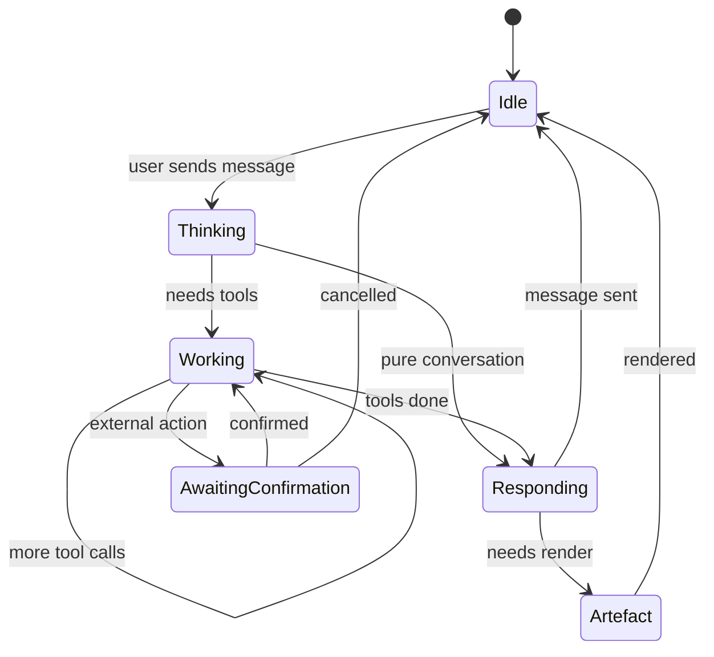
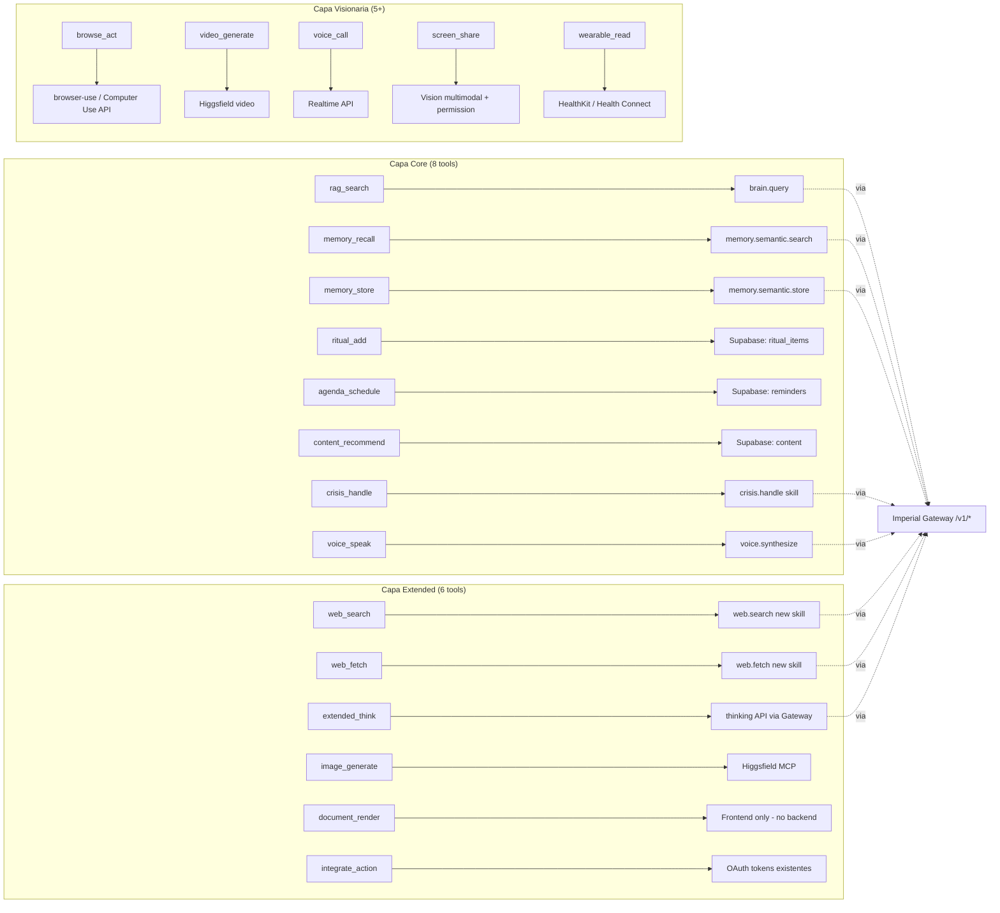
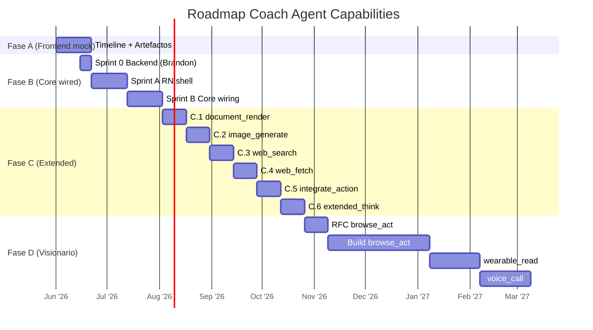

# RFC-001 — Coach Agent Capabilities

> **Estado:** DRAFT v1.0 · **Fecha:** 2026-05-26 · **Owner:** Diego (founder Mentex)
> **Audiencia:** Brandon (dev externo backend), equipo de diseño Mentex, futuras sesiones de IA que asistan a Diego.

---

## §0 — Status & Authority

**Tipo de documento:** Request For Comments — visión canónica de las capacidades del Coach Mentex y su presentación en el chat.

**Status:** DRAFT abierto a iteración. Una vez sellado por Diego, esta versión queda fija; los cambios se proponen vía PR contra este archivo.

**Documentos relacionados (autoridad descendente):**

- [`MENTEX_BACKEND_CONTRACT.md`](../backend/MENTEX_BACKEND_CONTRACT.md) — contrato técnico backend (BFF ↔ Gateway Imperial). Sellado Diego+Helios.
- [`04-AI-COACH.md`](../backend/04-AI-COACH.md) — implementación técnica del Coach (Vercel AI SDK, tools básicas, memory). Es la **contraparte backend** de este RFC. Cuando este RFC declara una tool, el doc 04 define su implementación HTTP.
- [`MENTEX_BRAND_BRIEF.md`](../marketing/MENTEX_BRAND_BRIEF.md) — voz de marca, tono, vocabulario. **Toda copy del chat debe cumplir el brand brief.**

**Regla cardinal:** este RFC NO inventa tools por verse bien. Cada capacidad listada debe (a) resolver un dolor real del usuario, (b) tener una contraparte backend implementable, (c) sentirse natural en el chat sin parecer programación. Si una tool no pasa los 3 filtros, queda fuera.

### Changelog

| Versión | Fecha | Cambio | Sellado por |
|---|---|---|---|
| 1.0-DRAFT | 2026-05-26 | RFC inicial. 3 capas de tools (Core/Extended/Visionario), 20 tipos de artefactos, UX timeline Manus-style, roadmap por fases. | Diego ⏳ |

---

## §1 — Resumen ejecutivo (1 pantalla)

Mentex está construyendo **un coach con esteroides**: no un chatbot que responde, sino un agente que **hace cosas por ti en el mundo real**. Lee tu vida (Memoria, Ritual, Agenda), busca en tu biblioteca, investiga en la web, genera artefactos visuales, **navega sitios en tu nombre** para reservar tu clase de yoga, comprar tu audiolibro o llenar un formulario. Y lo hace en un chat que **no se siente a programación** — bolitas suaves que pulsan, frases en gerundio cálido (*"Mirando tu agenda…"*, *"Pensando profundamente…"*), artefactos visuales como cards tocables, y confirmaciones humanas antes de cualquier acción externa.

**Tres capas, ningún cosmético:**

- **Capa Core (8 tools, lanzamiento):** las capacidades base ya documentadas en el contract backend. Buscar, recordar, agendar, recomendar, hablar por voz, manejar crisis. Conectan directamente con `/v1/skill/invoke` del Gateway Imperial.
- **Capa Extended (6 tools, 3 meses post-launch):** web search, web fetch, extended thinking, generación de imágenes (Higgsfield), renderizado de documentos visuales inline, acciones sobre integraciones conectadas.
- **Capa Visionaria (5+ tools, año 1+):** **`browse_act`** (browser automation real — el coach navega y actúa por ti), generación de videos personalizados, llamada de voz larga (Realtime API), comprensión de pantalla compartida, lectura de wearables (Apple Health, Oura, Whoop).

**El roadmap obliga a la realidad:** la Fase A (frontend del timeline con mock) arranca YA y permite ver/sentir la experiencia antes de tener backend. La Fase B (Core wired) corre paralela al Sprint B del backend de Brandon. Cada tool nueva en Extended/Visionario es un sprint dedicado con contraparte backend real, nunca solo UI.

**Premisa cultural:** *un coach con superpoderes, no una app de IA con features.* La gente debe sentir que tiene un mentor brillante en el bolsillo, no que está usando software.

---

## §2 — Motivación: por qué un agente con superpoderes

### 2.1 — Lo que existe hoy en wellness apps (la baseline)

- **Calm/Headspace:** contenido pasivo. Eliges un audio y le das play. Cero conversación.
- **Replika/Character.AI:** chat sin acciones reales. Hablan, no hacen.
- **ChatGPT/Claude apps:** generales, no contextuales. No conocen tu vida.
- **Notion AI/Mem.ai:** asistentes de notas, no de vida.

### 2.2 — La oportunidad

Ningún producto combina **(a) coach conversacional con memoria persistente** + **(b) ejecución real de tareas en tu vida y en el mundo** + **(c) catálogo de contenido enriquecedor integrado**.

El usuario de Mentex no quiere otra app de bienestar. Quiere a alguien que cuando le diga *"reservame yoga el sábado, lee este artículo sobre sueño y dime qué hago, y agéndame foco profundo a las 7am toda la semana"*, **lo haga**. Real. Sin que tenga que abrir 4 apps.

### 2.3 — El insight

> Un coach humano no solo escucha. **Hace cosas por ti.** Llama al doctor, te reserva la cita, te manda el libro, te recuerda que coma. Mentex tiene que poder hacer todo eso. Si no, es solo otro chatbot.

### 2.4 — Por qué ahora

- **Capacidades de los LLMs** ya soportan tool use robusto, planificación multi-paso, extended thinking, agente browser, y multimodalidad (imagen + voz).
- **Costos** bajaron al punto donde un coach activo puede costar $0.30/usuario/mes (margen sano sobre suscripción de $9.99).
- **MCP + estándares de tool calling** maduraron — el ecosistema de capacidades crece exponencialmente.
- **Higgsfield** (ya disponible en este entorno) genera imagen/video calidad producción.

---

## §3 — Filosofía (las reglas que mantienen esto coherente)

### 3.1 — Las 7 reglas inviolables del Coach

1. **Nada es cosmético.** Cada tool listada en este RFC tiene contraparte backend implementable. Si una tool no puede ejecutarse de verdad cuando el usuario la invoca, no la mostramos en el chat.
2. **El coach hace, no solo aconseja.** *"Te recomiendo reservar yoga"* es fallar. *"Te la reservé"* (con confirmación previa) es ganar.
3. **No parece programación.** Cero logs técnicos visibles. Cero nombres de APIs. Cero spinners corporativos. El chat se ve y se siente como una conversación con un mentor.
4. **Confirmación humana antes de actuar fuera de Mentex.** Cualquier acción externa (reservar, comprar, llenar formulario, mandar mensaje en tu nombre) requiere confirmación explícita del usuario.
5. **Memoria + contexto > comandos.** El coach recuerda lo que es importante. No haces login cada vez, no le explicas tu rutina cada vez. Te conoce.
6. **Suave > eficiente.** Si una animación de 200ms se ve mejor que una de 50ms, ganamos los 150ms. La calidad sentida está sobre la velocidad medida (dentro de límites razonables).
7. **El coach NO te juzga, NO te regaña, NO te mide en KPIs.** Tono cálido, sabio, sin paternalismo (ver `MENTEX_BRAND_BRIEF.md` §6).

### 3.2 — Anti-tools (lo que el coach NUNCA hace)

Lista negra deliberada — no son "todavía no", son **nunca**:

| Capacidad | Por qué NO |
|---|---|
| Operaciones financieras complejas (trading, transferencias, etc.) | Riesgo regulatorio + no es dominio Mentex |
| Comunicaciones médicas / diagnóstico | Liability + Mentex NO es terapia |
| Acceso a banca / contraseñas | Riesgo de seguridad inaceptable |
| Citas / romance / Tinder bots | Fuera del posicionamiento "wellness" |
| Compras automáticas sin confirmación humana | Viola regla §3.1.4 |
| Manipular emails en tu cuenta sin consentimiento explícito | Privacidad inviolable |
| Decisiones legales / tributarias | Liability |
| Hablar mal de otras apps/personas | Brand voice (ver brand brief §15) |

### 3.3 — Premisa cultural ("un coach con esteroides")

- El usuario tiene que poder decir, palabra por palabra: *"Es brutal. No hace solo lo que le digo, hace lo que necesito que pase."*
- El coach proyecta **calma + competencia**. Como ese amigo que en una crisis no se altera, sabe qué hacer, y lo resuelve.
- Cuando algo falla (porque va a fallar), el coach **lo comunica con dignidad**: *"No pude reservar la clase. La sala estaba llena. Te dejé 2 alternativas."* — nunca *"Error 500"*.

---

## §4 — Catálogo completo de tools

Las 3 capas, con todas las dependencias técnicas explícitas.

### 4.1 — Capa CORE (8 tools — lanzamiento)

> Ya documentadas en [`04-AI-COACH.md`](../backend/04-AI-COACH.md) §4.6. Aquí las refino con nombre user-facing y conexión a artefactos visuales.

| # | Nombre interno | Nombre user-facing (timeline) | Qué hace | Backend dep | Artefacto final |
|---|---|---|---|---|---|
| 1 | `rag_search` | *Buscando en tu biblioteca…* | Consulta knowledge curado | `brain.query` Gateway | Recommendation card |
| 2 | `memory_recall` | *Recordando lo que sé de ti…* | Lee hechos persistentes del user | `memory.semantic.search` Gateway | Memory recall card |
| 3 | `memory_store` | *Guardando esto en tu Memoria…* | Persiste un hecho relevante | `memory.semantic.store` Gateway | Confirmation card (suave) |
| 4 | `ritual_add` | *Sumando a tu Ritual…* | Agrega item al ritual del día | DB Supabase (`mentex.ritual_items`) | Plan card update |
| 5 | `agenda_schedule_reminder` | *Programando en tu Agenda…* | Crea reminder | DB Supabase (`mentex.reminders`) | Calendar mini card |
| 6 | `content_recommend` | *Eligiendo algo para ti…* | Recomienda contenido del catálogo | DB Supabase (`mentex.content`) + opcional `brain.query` | Recommendation card |
| 7 | `crisis_handle` | *Aquí estoy contigo* | Protocolo de crisis (suicidal ideation, autolesión, abuso) | Skill imperial `crisis.handle` | Crisis support card (recursos pro) |
| 8 | `voice_speak` | *Te lo cuento en voz…* | TTS — el coach habla en voz alta | `voice.synthesize` Gateway | Audio waveform inline |

**Criterio de Done Core:** las 8 tools wired al backend real (no mock), invocadas desde Vercel AI SDK en el BFF, renderizadas en el `<CoachTimeline />` con sus artefactos correspondientes. Ver §8.2.

### 4.2 — Capa EXTENDED (6 tools — 3 meses post-launch)

> Nuevas tools que amplían el coach a buscador web + creador visual + actor sobre integraciones.

| # | Nombre interno | Nombre user-facing | Qué hace | Backend dep | Artefacto final |
|---|---|---|---|---|---|
| 9 | `web_search` | *Buscando en la web…* | Búsqueda web actualizada (Brave/Google/Perplexity API) | Nueva skill `web.search` en Gateway OR provider directo en BFF (decisión Helios) | Source list card con links |
| 10 | `web_fetch` | *Leyendo el artículo que me compartiste…* | Lee una URL específica (artículo, paper, post) | Nueva skill `web.fetch` (con HTML→text + summarize) | Article summary card |
| 11 | `extended_think` | *Pensando profundamente…* | Razonamiento extendido para queries complejas (planificar mes, analizar patrones) | Anthropic `thinking` API o equivalente vía Gateway | Thinking expandable + answer |
| 12 | `image_generate` | *Pintando algo para ti…* | Genera imagen personalizada (quote, visualización, cover) | Higgsfield MCP `generate_image` (ya disponible) | Image card inline |
| 13 | `document_render` | *Armando tu plan…* | Renderiza artefacto visual rico (plan semanal, weekly recap, reflexión del mes, diario, plan de reto) | Frontend pure (no backend) — usa tipos definidos en §5.2 | El artefacto correspondiente |
| 14 | `integrate_action` | *Conectando con [Notion/Google Cal/Spotify]…* | Ejecuta acción sobre una integración ya conectada (crear evento en Cal, agregar nota a Notion, crear playlist Spotify) | OAuth tokens existentes + endpoints providers | Confirmation card específica por provider |

**Criterio de Done Extended:** cada tool con backend real + UX terminado + caso de uso narrable. NO se libera ninguna sin (a)(b)(c) de §0 cumplidos.

### 4.3 — Capa VISIONARIA (5+ tools — año 1+)

> Las que vuelven a Mentex algo único en el mercado. **`browse_act` es el killer feature que define el año 1.**

| # | Nombre interno | Nombre user-facing | Qué hace | Backend dep |
|---|---|---|---|---|
| 15 | **`browse_act`** | *Haciéndolo por ti en internet…* | El coach **navega un sitio web y actúa**: reserva tu clase de yoga en MindBody, compra un audiolibro en Audible/Amazon, llena un formulario, busca un producto, hace un check-in, agenda una cita. | Browser-use / Computer Use API / Playwright agent. Decisión arquitectónica nueva (Helios). |
| 16 | `video_generate` | *Animando algo especial…* | Genera videos cortos personalizados: tu *Year in Mentex*, animación de progreso, reel motivacional, micro-meditación visual. | Higgsfield `generate_video` (ya disponible) |
| 17 | `voice_call` | *Llamando contigo…* | Conversación de voz larga, fluida, sin turn-taking rígido. Como una sesión de 30-60 min con un coach humano. | Realtime API (OpenAI/Anthropic equivalente) vía Gateway o directo |
| 18 | `screen_share_understand` | *Mirando tu pantalla contigo…* | El coach ve tu pantalla y te ayuda (configurar algo, leer un email difícil, entender un documento). | Computer Vision multimodal + permission iOS/Android |
| 19 | `wearable_read` | *Mirando cómo dormiste anoche…* | Lee Apple Health/Oura/Whoop/Garmin y ajusta tu Ritual del día en base a sueño/HRV/stress real. | HealthKit (iOS) + Health Connect (Android) + APIs Oura/Whoop |
| 20+ | (futuras) | (a definir) | Localización + recomendación contextual, IoT en casa (Hue/Sonos para sesión), etc. | TBD |

**Criterio de Done Visionario:** cada una requiere RFC propio (sprint dedicado con design + arquitectura + legal/privacy review). `browse_act` es la prioridad año 1.

---

## §5 — UX del chat: timeline + artefactos

### 5.1 — El componente `<CoachTimeline />`

#### Anatomía visual

```
┌─────────────────────────────────────────────────┐
│  ✨  [avatar del coach]                          │
│      ◐  Mirando tu agenda                       │  ← step en progreso
│      ✓  Recordando lo que sé de ti              │  ← step completado
│      ●  Pensando profundamente                  │  ← step actual (pulsando)
│      ○  Armando tu plan                         │  ← step pendiente
│                                                  │
│      [respuesta del coach aquí cuando termine]  │
│                                                  │
│      [artefacto visual aquí si aplica]          │
│                                                  │
│      [ Ver detalles técnicos ▾ ]  ← collapsed   │
└─────────────────────────────────────────────────┘
```

#### Estados de cada step

| Estado | Visual | Animación |
|---|---|---|
| `pending` | ○ outline circle, 60% opacity | none |
| `active` | ● filled circle, neon Mentex | pulse 1.2s opacity 0.6→1.0 |
| `done` | ✓ checkmark, 80% opacity | fade-in 200ms |
| `failed` | ⊘ ring con × discreto | shake 300ms once |
| `cancelled` | ⊙ ring vacío | fade-out then hidden |

#### Reglas del timeline

1. **No se muestra para queries triviales (<1 tool, <800ms).** El coach responde directo, sin timeline.
2. **Se muestra desde el segundo step.** Si el coach va a hacer 1 sola cosa que tarda <2s, no abre timeline; muestra dot único pulsando junto al avatar.
3. **Máximo visible 6 steps simultáneos.** Si hay más, se colapsan los completados (*"+3 pasos más"*) y el activo está siempre visible.
4. **Animación de aparición:** cada step nuevo entra con `slide-down 200ms + fade-in 150ms`.
5. **Tipografía:** ligeramente más pequeña que el cuerpo del mensaje (e.g. 13px vs 15px), opacidad 0.85.
6. **Color:** neon Mentex con alpha 0.7. Cuando completa: white 0.8.
7. **NO mostrar nombres de skill internos.** Nunca *"calling brain.query"*. Siempre la frase en gerundio del catálogo (§5.6).
8. **Cancelación visible cuando aplique:** si el coach lleva >5s en un step, aparece un *"Cancelar"* discreto al lado del step activo.
9. **Click en step expandido:** muestra inputs/outputs reales en JSON-collapsable. Default colapsado. Para users curiosos / debugging.

#### Estados del coach (state machine)



### 5.2 — Catálogo de 20 tipos de artefactos visuales

> Cada artefacto es un componente React (en producción Expo: un component RN) con shape definido. El `document_render` tool (§4.2 #13) emite cualquiera de estos.

| # | Tipo | Cuándo se usa | Mockup conceptual |
|---|---|---|---|
| 1 | **Plan Card** | Plan semanal/mensual, ritual de varios días | Card de 200-400px con timeline mini de días, tap to expand |
| 2 | **Recommendation Card** | Recomendar 1 contenido específico (audiolibro, meditación) | Cover art + título + autor + duración + CTA "Reproducir" |
| 3 | **Recommendation List** | Recomendar 2-5 contenidos | Stack vertical de Recommendation Cards compactas |
| 4 | **Insight Card** | *"Esta semana dormiste 7.2h promedio"* | Card con métrica grande + contexto (1 línea) + trend visual |
| 5 | **Mermaid Diagram** | Visualizar patrones, conexiones, flujos (mind-map de la semana, decision tree) | Embebido inline con react-mermaid; aspect-ratio ≤2:1 mobile |
| 6 | **Image Inline** | Generada por `image_generate` | 1:1 o 4:5 con borde sutil neón, tap to fullscreen |
| 7 | **Video Inline** | Generado por `video_generate` (futuro) | Player nativo embebido con controles minimalistas |
| 8 | **Quote Card** | Citas con autor y fondo bonito | Fondo gradiente sutil + tipografía serif + autor pequeño abajo |
| 9 | **Comparison Table** | Comparar opciones (3 audiolibros lado a lado) | Tabla compacta con 2-3 columnas, scroll horizontal si excede |
| 10 | **Step-by-Step Card** | Guía multi-paso (configurar Apple Watch) | Lista numerada con expandable per step |
| 11 | **Progress Visualization** | Tu progreso del reto / streak | Barra estética + número grande + contexto |
| 12 | **Calendar Mini-View** | Vista mini del calendario con eventos del día/semana | Grid 7×N días con dots para eventos, tap to open Agenda |
| 13 | **Map Mini** | Sugerencias de lugares cercanos | Map preview + 3 markers + tap to maps app |
| 14 | **Confirmation Card** | *"¿Confirmas que reservo yoga sábado 9am?"* | Resumen de la acción + dos CTAs (confirmar / cancelar) |
| 15 | **Error Gentle** | Algo falló (cuando algo falla) | Mensaje cálido + opción "intentar de nuevo" o alternativa |
| 16 | **Loading Skeleton** | Mientras carga algo (raramente; preferimos no mostrar) | Pulsing rectangle, mismo height del contenido esperado |
| 17 | **Audio Waveform Inline** | Mensajes de voz del coach o sonidos sugeridos | Waveform animado + play button + duración |
| 18 | **Stats Compact** | Métricas humanas compactas (3-4 stats en row) | Row horizontal con `valor / etiqueta` por stat |
| 19 | **Timeline Mini** | Eventos en tiempo (ej. evolución del mes) | Línea horizontal con dots de eventos clave |
| 20 | **Memory Recall Card** | Cuando el coach muestra qué recordó de ti | Lista de hechos persistentes + opción "olvidar este" |

#### Reglas universales de artefactos

- **Todos son tocables y expandibles.** Tap corto = expandir/contraer. Tap largo = opciones (compartir, editar, agendar, eliminar).
- **Todos tienen modo dark-first.** Mentex es neon sobre obsidiana. Light mode es opcional (futuro).
- **Border radius consistente:** 14px para cards grandes, 10px para chips/buttons.
- **Sombras sutiles:** `0 4px 24px rgba(0,0,0,0.4)` con accent neon glow opcional.
- **Tipografía:** Inter o SF Pro Display (sistema). Serif (New York o similar) solo para citas y artefactos contemplativos.
- **Aspect ratios respetados:** mobile-first. Cards no exceden 90vw width.
- **Animación de entrada:** `scale 0.96 → 1.0` + `opacity 0 → 1` en 250ms cubic-bezier(0.2, 0.9, 0.3, 1).

### 5.3 — Confirmaciones y guardas

#### Cuándo el coach pide confirmación

**SIEMPRE pide confirmación antes de:**
- Reservar / comprar / pagar algo
- Mandar mensaje en tu nombre (WhatsApp, email, etc.)
- Llenar formularios externos
- Conectar nueva integración
- Borrar Memoria (suya o tuya)
- Cancelar suscripción / cambiar plan
- Acceder a wearable por primera vez (después de OAuth ya es libre)

**NUNCA pide confirmación para (acciones locales reversibles):**
- Agregar item a Ritual (es soft, se puede quitar)
- Programar reminder (se puede borrar)
- Guardar nota a Memoria (se puede editar/borrar después)
- Recomendar contenido (es solo sugerencia)
- Buscar en su biblioteca / web

#### Shape de la Confirmation Card (artefacto #14)

```
┌─────────────────────────────────────────────┐
│  Antes de hacerlo:                          │
│                                             │
│  ☞  Reservar Yoga Flow                      │
│  ☞  Casa del Yoga · Sábado 9:00 am          │
│  ☞  20 min en bici desde tu casa            │
│  ☞  Pago $15 con tu tarjeta terminada 4242  │
│                                             │
│  [ Adelante, hazlo ]    [ Cancelar ]        │
└─────────────────────────────────────────────┘
```

> Tono cálido + información completa + opt-out fácil. Nunca *"¿Confirma la transacción? OK / Cancelar"*.

### 5.4 — Las 10 reglas UX inviolables (recap del análisis)

> Repetidas aquí porque son tan importantes que merecen estar en el contrato.

1. Frases en español natural, gerundio cálido — nunca logs técnicos.
2. Bolitas mínimas con animación suave — sin spinners corporativos.
3. No mostrar timeline para queries triviales.
4. Expandable opcional, default colapsado.
5. Artefactos finales como cards tocables, no texto plano de markdown.
6. Color y movimiento muy contenidos.
7. Tipografía del timeline secundaria al cuerpo del mensaje.
8. Cero nombres de skill internos visibles.
9. Cancelación visible cuando aplique.
10. El coach acepta interrupciones del usuario mientras piensa.

### 5.5 — Estados del coach en el chat (con copy concreto)

| Estado | Cuándo | Copy en el chat (ejemplo) |
|---|---|---|
| `idle` | Sin actividad, esperando input | (sin indicador visual) |
| `listening_voice` | User está hablando | Microondas animadas + transcripción en vivo |
| `thinking_brief` | Pensando <2s, 1 tool | Dot pulsando junto al avatar |
| `thinking_deep` | Pensando >2s o multi-tool | Timeline visible |
| `working` | Ejecutando tools | Timeline con steps activos |
| `awaiting_confirmation` | Acción externa requiere OK | Confirmation Card visible, no continúa hasta input |
| `responding` | Mostrando respuesta final | Streaming text con cursor pulsando |
| `rendering_artefact` | Artefacto en construcción | Skeleton del artefacto luego fade-in |
| `done` | Listo, esperando siguiente input | Estado vuelve a `idle` |
| `failed_gentle` | Algo falló | Error Gentle card + sugerencia de retry |

### 5.6 — Catálogo de frases user-facing (gerundios cálidos)

> Toda copy del timeline sale de esta lista. Si una tool nueva no tiene frase aquí, se agrega vía PR a este RFC.

| Tool / acción | Frase principal | Variantes (random) |
|---|---|---|
| `rag_search` | *Buscando en tu biblioteca* | *"Mirando qué tenemos sobre esto"*, *"Revisando el catálogo"* |
| `memory_recall` | *Recordando lo que sé de ti* | *"Trayendo a la mente lo que me contaste"*, *"Mirando tu Memoria"* |
| `memory_store` | *Guardando esto en tu Memoria* | *"Anotando para no olvidarlo"* |
| `ritual_add` | *Sumando a tu Ritual* | *"Agregándolo a tu día"* |
| `agenda_schedule_reminder` | *Programando en tu Agenda* | *"Apuntándolo para la hora correcta"* |
| `content_recommend` | *Eligiendo algo para ti* | *"Buscando lo que más te puede servir hoy"* |
| `crisis_handle` | *Aquí estoy contigo* | (NO usar variantes; consistencia crítica) |
| `voice_speak` | *Te lo cuento en voz* | *"Te lo digo en audio"* |
| `web_search` | *Buscando en la web* | *"Mirando qué se está diciendo afuera"* |
| `web_fetch` | *Leyendo el artículo que me compartiste* | *"Estudiando ese link"* |
| `extended_think` | *Pensando profundamente* | *"Dejándolo decantar un momento"* |
| `image_generate` | *Pintando algo para ti* | *"Visualizándolo"* |
| `document_render` | *Armando tu plan* | *"Dándole forma"* |
| `integrate_action` | *Conectando con [Notion]* | *"Hablando con [Spotify]"* |
| `browse_act` | *Haciéndolo por ti en internet* | *"Yendo a hacerlo en tu lugar"* |
| `video_generate` | *Animando algo especial* | *"Componiéndolo"* |
| `voice_call` | *Llamando contigo* | (sin variantes) |
| `screen_share_understand` | *Mirando tu pantalla contigo* | *"Viendo lo mismo que tú"* |
| `wearable_read` | *Mirando cómo dormiste anoche* | *"Leyendo tu cuerpo de hoy"* |

**Regla:** las variantes se seleccionan random pero **stickán por sesión** — la primera variante elegida en una conversación se mantiene durante esa sesión para que el lenguaje no oscile.

---

## §6 — Especificación técnica de componentes

### 6.1 — `<CoachTimeline />`

```typescript
type TimelineStep = {
  id: string;
  toolName: string;          // 'rag_search', etc.
  copyKey: string;           // index en §5.6 catalog
  status: 'pending' | 'active' | 'done' | 'failed' | 'cancelled';
  startedAt?: number;        // ms timestamp
  completedAt?: number;
  error?: { message: string; retryable: boolean };
  rawInput?: unknown;        // para "Ver detalles"
  rawOutput?: unknown;
};

type CoachTimelineProps = {
  steps: TimelineStep[];
  onCancel?: (stepId: string) => void;
  showDetails?: boolean;     // default false
  variant?: 'inline' | 'fullwidth';
};
```

**Comportamiento:**
- Subscribe a `window.__mtxCoach.onUpdate(callback)` para steps en tiempo real.
- Auto-scrolls al step activo si está fuera de viewport.
- Cancel button aparece después de 5000ms en un step activo.
- "Ver detalles" toggle persiste preferencia en `localStorage`.

### 6.2 — `<CoachArtifact />`

```typescript
type ArtifactType =
  | 'plan_card'
  | 'recommendation_card'
  | 'recommendation_list'
  | 'insight_card'
  | 'mermaid_diagram'
  | 'image_inline'
  | 'video_inline'
  | 'quote_card'
  | 'comparison_table'
  | 'step_by_step'
  | 'progress_viz'
  | 'calendar_mini'
  | 'map_mini'
  | 'confirmation_card'
  | 'error_gentle'
  | 'loading_skeleton'
  | 'audio_waveform'
  | 'stats_compact'
  | 'timeline_mini'
  | 'memory_recall_card';

type Artifact = {
  id: string;
  type: ArtifactType;
  data: unknown;             // shape per type
  actions?: ArtifactAction[];
  createdAt: number;
};

type ArtifactAction = {
  label: string;
  intent: 'primary' | 'secondary' | 'destructive';
  onPress: () => void;
  requiresConfirmation?: boolean;
};
```

**Comportamiento:**
- Renderer factory: `<CoachArtifact />` lee `type` y delega al componente específico (`<PlanCard />`, `<RecommendationCard />`, etc.).
- Cada componente específico es lazy-loaded para reducir bundle size.
- Acciones (`actions[]`) renderan como CTAs en el footer del artefacto.
- Long-press abre context menu con: Compartir, Editar, Eliminar, Agendar.

### 6.3 — Store `__mtxCoach` (durante el prototipo HTML)

```javascript
window.__mtxCoach = {
  state: {
    status: 'idle',            // ver §5.5
    currentSteps: [],          // TimelineStep[]
    currentArtefact: null,     // Artifact | null
    awaitingConfirmation: null // ConfirmationRequest | null
  },

  // Actions
  startThinking(toolNames),
  updateStep(stepId, patch),
  completeStep(stepId, output),
  failStep(stepId, error),
  cancelStep(stepId),
  emitArtefact(artefact),
  requestConfirmation(req),
  resolveConfirmation(confirmed),
  reset(),

  // Subscriptions
  onUpdate(callback) -> unsubscribe,

  // Dev helpers
  __debug: { simulateScenario(name) }
};
```

> En el prototipo HTML usamos `window.__mtxCoach`. En la migración a Expo se convierte en Zustand store `useCoachStore`.

---

## §7 — Cableado backend (qué tools dependen de qué endpoints)

### 7.1 — Mapa de dependencias



### 7.2 — Skills nuevas que requieren coordinación con Helios

| Tool | Skill backend | Status | Acción requerida |
|---|---|---|---|
| `web_search` (#9) | `web.search` | NO existe | Solicitar a Helios o construir BFF-side con Brave/Perplexity API |
| `web_fetch` (#10) | `web.fetch` | NO existe | Igual que arriba |
| `extended_think` (#11) | thinking API | Parcial | Verificar disponibilidad en `/v1/skill/invoke` (skill_describe en Sprint 0) |
| `browse_act` (#15) | browser agent | NO existe | Diseño arquitectónico nuevo. RFC propio futuro. |
| `voice_call` (#17) | Realtime stream | NO existe | Decisión latencia/costos pendiente |

### 7.3 — Tools que NO requieren cambios backend

- `document_render` (#13): puramente frontend.
- `image_generate` (#12): usa Higgsfield MCP directamente desde BFF (ya disponible en este entorno claude.ai).
- `integrate_action` (#14): usa OAuth tokens existentes en `mentex.integrations`.

---

## §8 — Roadmap de implementación

### 8.1 — Fase A: Frontend del Timeline + Artefactos (mock data, sin backend)

**Duración:** 2-3 semanas
**Output:** experiencia jugable en el prototipo HTML actual

**Entregables:**
- [ ] `screens/coach-timeline.jsx` — componente `<CoachTimeline />` (§6.1)
- [ ] `screens/coach-artefacts.jsx` — componente `<CoachArtifact />` con factory (§6.2)
- [ ] 20 artefactos implementados (§5.2)
- [ ] Store `window.__mtxCoach` con state machine (§6.3)
- [ ] Integración en `ia-flow.jsx` reemplazando UI actual del chat
- [ ] `__mtxCoach.__debug.simulateScenario(name)` con 10+ escenarios:
  - Query simple (1 tool, sin timeline)
  - Query media (3 tools)
  - Query compleja con artefacto plan
  - Recomendación de audiolibro
  - Crisis handler
  - Confirmation flow (reserva yoga mock)
  - Error gentle + retry
  - Cancel mid-thinking
  - Extended thinking
  - Multi-artefacto en respuesta
- [ ] Auditoría C-A-R completa (CRIT + IMP)
- [ ] Smoke test 20 escenarios verde
- [ ] Lessons doc `docs/audits/phase-coach-timeline-lessons.md`

**Gate de Done:** Diego usa el prototipo, le hace 10 queries distintas (mock), siente que es *"un coach con esteroides"*.

### 8.2 — Fase B: Core wiring real (paralelo a Sprint B backend)

**Duración:** 2-3 semanas (overlap con Sprint B de Brandon)
**Pre-requisito:** Sprint 0 del backend pasado (contract test rig verde)

**Entregables:**
- [ ] BFF: `gatewayModel` provider implementado (doc 04 §4.4)
- [ ] BFF: las 8 tools del catálogo Core wired al Gateway real
- [ ] BFF: endpoint `POST /api/coach/chat` con streaming SSE (doc 04 §4.7)
- [ ] BFF: `memory.conversation.recall/append` por turno
- [ ] BFF: premium-gate antes de cada `streamText`
- [ ] BFF: mapeo de errores Gateway → mensajes user-friendly (doc 04 §4.10)
- [ ] Frontend: client SSE en RN (`react-native-sse` o equivalente)
- [ ] Frontend: cableado real del `<CoachTimeline />` al stream del BFF
- [ ] E2E test: conversación de 10 mensajes con tools reales

**Gate de Done:** Diego habla con el coach desde TestFlight build, las 8 tools ejecutan acciones reales en su Supabase (ve cambios en su Ritual/Agenda), recibe recomendaciones reales del catálogo, recall/store de memoria funciona persistente entre sesiones.

### 8.3 — Fase C: Extended (6 tools, post-launch)

**Duración:** 6 sprints (1 tool por sprint, ~2 semanas cada uno)

**Orden recomendado (impacto > esfuerzo):**

1. **Sprint C.1 — `document_render` (#13)**: frontend pure, sin dependencia backend. Habilita planes/reports/recaps. Impacto alto, esfuerzo bajo.
2. **Sprint C.2 — `image_generate` (#12)**: usa Higgsfield MCP. Habilita quotes con cover, visualizaciones. Wow factor alto.
3. **Sprint C.3 — `web_search` (#9)**: backend nuevo. Habilita coach con info actualizada.
4. **Sprint C.4 — `web_fetch` (#10)**: extensión natural de #9.
5. **Sprint C.5 — `integrate_action` (#14)**: leverage OAuth ya conectados. Habilita acciones sobre Notion/Spotify/Cal.
6. **Sprint C.6 — `extended_think` (#11)**: depende de Anthropic thinking API o equivalente. Habilita queries muy complejas.

Cada sprint termina con: tool wired + UX terminado + auditoría C-A-R + caso de uso narrable + lessons doc.

### 8.4 — Fase D: Visionario (año 1+)

**Cada tool aquí es un RFC propio.** No se construye nada sin (a) diseño detallado, (b) revisión legal/privacidad, (c) decisión arquitectónica del Imperio (`browse_act` requiere infra significativa).

**Orden tentativo (priorizando killer features):**

1. **`browse_act` (#15)** — *killer feature año 1*. RFC dedicado. Diseño con Helios.
2. **`wearable_read` (#19)** — quick win con Apple Health/Health Connect. Diseño relativamente simple.
3. **`voice_call` (#17)** — alto valor pero alto costo (Realtime API). Pricing tier propio.
4. **`video_generate` (#16)** — diferenciador de marca (Year in Mentex, motivacionales personalizados).
5. **`screen_share_understand` (#18)** — diseño UX + privacy complejo. Posponer.

### 8.5 — Diagrama del roadmap



---

## §9 — Métricas de éxito por capa

### 9.1 — Capa Core (lanzamiento)

| Métrica | Target | Cómo medirlo |
|---|---|---|
| Tool call success rate | ≥98% | Logs BFF: `tool_call_status='completed'` |
| Avg latency tool call | <2.5s p95 | Métricas Prometheus por namespace |
| % conversaciones con ≥1 artefacto | ≥40% | Telemetría frontend |
| User satisfaction "se siente como coach humano" | ≥4.3/5 | NPS post-conversación |
| Tasa de uso de timeline expandido ("Ver detalles") | <5% | Solo curiosos lo abren — confirma que default-collapsed es correcto |
| % errores Gentle (vs hard) | 100% | Auditoría manual de logs |

### 9.2 — Capa Extended (post-launch)

| Métrica | Target |
|---|---|
| Adopción `document_render` | ≥30% MAU genera ≥1 artefacto/semana |
| Adopción `image_generate` | ≥20% MAU genera ≥1 imagen/mes |
| Adopción `web_search` | ≥50% MAU usa ≥1/mes |
| Adopción `integrate_action` | ≥10% MAU (gated por integración conectada) |

### 9.3 — Capa Visionaria (año 1+)

| Métrica | Target |
|---|---|
| `browse_act` success rate (% tareas completadas sin intervención humana) | ≥80% |
| `browse_act` Net Promoter | ≥60 ("¿recomendarías esta feature a un amigo?") |
| `voice_call` retention boost | usuarios con ≥1 voice call al mes tienen ≥2x retention vs no |

---

## §10 — Riesgos y mitigaciones

| Riesgo | Probabilidad | Impacto | Mitigación |
|---|---|---|---|
| Brandon construye Coach loop pero olvida cablear timeline al SSE | Media | Alto | Test E2E en Sprint B gating release |
| Higgsfield API genera imágenes inapropiadas para users | Baja | Alto | Filtro de contenido + moderación + reportar |
| `browse_act` reserva mal por bug de UI del sitio target | Media | Medio | Confirmation Card obligatoria + screenshot pre-acción |
| Privacy backlash por `screen_share` | Media | Alto | Permission por sesión + indicador visual + audit log |
| Costos LLM disparados por `extended_think` mal usado | Media | Medio | Premium-gate quota más estricta para extended_think (G1) |
| Timeline tarda en cargar en Android low-end | Alta | Medio | Test en device $200, disable animaciones si <60fps |
| `voice_call` Realtime API costos prohibitivos | Alta | Alto | Pricing tier Pro Plus, no free, con minutos limitados |
| Tools con personality drift (coach suena diferente entre tools) | Alta | Medio | Catálogo de frases canónico §5.6, lint en CI |
| Falta de tooling para `browse_act` legal en algunas jurisdicciones | Alta | Alto | Geo-fence inicial (LATAM + España), expand gradual con review legal |

---

## §11 — Casos de uso end-to-end (storyboard)

> Cada uno es la **prueba de fuego** de las capacidades. Si el coach NO puede ejecutar estos, hay que rediseñar.

### 11.1 — "Plánnea mi semana siguiente"

```
👤 Tengo presentación importante el jueves y vuelo a Bogotá el viernes.
   Plánnea mi semana — ritual, foco, descanso.

✨ ●  Mirando tu agenda
   ●  Recordando lo que sé de ti
   ●  Pensando profundamente
   ●  Armando tu plan
   ✓  Listo

   Te dejé un plan en forma de diario:

   ┌────────────────────────────────────────┐
   │ 📓 Tu semana — 21 a 27                 │
   │                                        │
   │ Lun  ◐ Foco profundo 7am              │
   │      ◐ Hábitos Atómicos cap 4 (30 min)│
   │ Mar  ◐ Meditación mañana (10 min)     │
   │      ◐ Sesión foco 14:00 (90 min)     │
   │ Mié  ◐ Repaso ligero presentación 7am │
   │      ◐ Descanso largo en la tarde     │
   │ Jue  ⚡ Solo presentación             │
   │      Sin ritual pesado, día completo  │
   │ Vie  ✈️ Viaje                         │
   │      Meditación de viaje (8 min)      │
   │ Sáb  ◯ Día libre                      │
   │ Dom  ◐ Cierre reflexivo 21:00         │
   │                                        │
   │ [ Agendarlo todo ] [ Ajustar ]        │
   └────────────────────────────────────────┘

   Notas:
   • El jueves dejé libre adrede — concentrate solo en la presentación.
   • El viernes el ritual es minimalista para no estresar el viaje.
   • El sábado lo dejé abierto — descansa.

   ¿Te gusta así o ajustamos algo?
```

**Tools usadas:** `memory_recall`, `extended_think`, `document_render` (plan_card).
**Artefactos:** plan_card.

### 11.2 — "Reservame yoga sábado"

```
👤 Reservame yoga sábado por la mañana cerca de mi casa.

✨ ●  Buscando opciones cerca
   ●  Mirando tu historial — ya fuiste a "Casa del Yoga"
   ✓  Encontré 3

   Te recomiendo la primera (instructor que ya te gustó):

   ┌────────────────────────────────────────┐
   │ Yoga Flow · Sábado 9:00 am             │
   │ Casa del Yoga                          │
   │ 20 min en bici desde tu casa           │
   │ Instructor: María (4.8 ⭐ - ya fuiste) │
   │ $15 · plazas disponibles               │
   │                                        │
   │ Otras opciones:                        │
   │ ◯ Yoga Restaurativa · Sáb 10:30 · $18 │
   │ ◯ Vinyasa Flow · Sáb 11:00 · $20      │
   └────────────────────────────────────────┘

   ¿La reservo?

   [ Sí, reservar Yoga Flow ] [ Otras opciones ]
```

→ Si user confirma →

```
✨ ●  Yendo a hacerlo en tu lugar
   ●  Eligiendo clase
   ●  Confirmando pago con tu tarjeta 4242
   ●  Generando código QR
   ✓  Listo

   Reservada. Ya está en tu Agenda.

   ┌────────────────────────────────────────┐
   │ ✓ Yoga Flow · Sábado 9:00 am          │
   │ Confirmación: #YF-20260530             │
   │ [ Ver QR ] [ Agregar a Wallet ]       │
   └────────────────────────────────────────┘

   Te recordaré salir a las 8:35 de tu casa.
```

**Tools usadas:** `web_search`, `memory_recall`, `browse_act`, `agenda_schedule_reminder`.
**Artefactos:** recommendation_list, confirmation_card, then plan update card.

### 11.3 — "Cómo dormí esta semana"

```
👤 Cómo dormí esta semana?

✨ ●  Mirando tu cuerpo de la semana
   ✓  Listo

   ┌────────────────────────────────────────┐
   │ Esta semana                             │
   │                                         │
   │ 6h 42min  promedio                     │
   │ 87%       calidad (HRV + profundo)     │
   │ ▆▅▆▇▆▄▇  (lun a dom)                  │
   │                                         │
   │ Tu peor noche: jueves (4h 30)          │
   │ Tu mejor noche: domingo (8h 15)        │
   └────────────────────────────────────────┘

   El jueves dormiste muy poco. ¿Algo pasó esa noche?
   Si quieres, te ayudo a entender el patrón.
```

**Tools usadas:** `wearable_read` (Apple Health), `extended_think` (análisis).
**Artefactos:** insight_card con stats_compact + sparkline.

### 11.4 — "Léeme este artículo"

```
👤 [pega URL: https://hubermanlab.com/sleep-protocol]
   Léeme este artículo y dime las 3 cosas que aplican a mí.

✨ ●  Estudiando ese link
   ●  Recordando lo que sé de ti (dormiste mal jueves)
   ●  Pensando profundamente
   ✓  Listo

   El artículo cubre 9 protocolos de sueño. De esos, 3 te calzan
   exactamente porque ya conozco tu rutina:

   ┌────────────────────────────────────────┐
   │ 1. Luz solar 5-10 min al despertar     │
   │    Por qué a ti: te despiertas con     │
   │    cortinas cerradas. Probemos abrirlas│
   │    apenas suene el despertador.        │
   │                                         │
   │ 2. No comer 2h antes de dormir         │
   │    Por qué a ti: cenas a las 21:00 y   │
   │    duermes a las 22:30. Movemos cena   │
   │    a las 20:00?                        │
   │                                         │
   │ 3. Temperatura del cuarto 18-19°C      │
   │    Por qué a ti: cuarto en 22°C según  │
   │    tu casa inteligente. Bajamos a 19?  │
   │                                         │
   │ [ Aplicar los 3 ] [ Solo el primero ]  │
   │ [ Ver artículo completo ]              │
   └────────────────────────────────────────┘
```

**Tools usadas:** `web_fetch`, `memory_recall`, `wearable_read`, `extended_think`.
**Artefactos:** step_by_step_card con CTAs.

### 11.5 — "Crisis"

```
👤 No puedo más. Pensé en hacerme daño.

✨ Aquí estoy contigo.

   ┌────────────────────────────────────────┐
   │ Lo que dijiste me importa. Estás       │
   │ pasando por algo difícil.              │
   │                                         │
   │ Antes de cualquier otra cosa:          │
   │                                         │
   │ 🇨🇴  Línea 106 (24/7, gratis)         │
   │     Toca para llamar                   │
   │                                         │
   │ 🌎  Mensaje al 741741                  │
   │     Toca para abrir                    │
   │                                         │
   │ Si estás en peligro inmediato,         │
   │ por favor llama al 123.                │
   └────────────────────────────────────────┘

   No estoy aquí para reemplazar ayuda
   profesional. Estoy para acompañarte mientras
   buscas a alguien que sí pueda hacerlo.

   ¿Quieres que te ayude a contactar a un
   profesional ahora mismo?
```

**Tools usadas:** `crisis_handle` (solo esta — protocolo dedicado).
**Artefactos:** crisis_support_card (variante de step_by_step con dial-out CTAs).
**Crítico:** este flow NO usa el timeline normal. Va directo al artefacto. Cero animaciones cute. Tipografía un punto más grande. Botones tap-targets más grandes (recursos pro accesibles instant).

---

## §12 — Anti-patterns / lo que NO hacemos

### 12.1 — En el código

- ❌ **NO** mostrar nombres de skill (`brain.query`, `memory.semantic.search`) en el timeline.
- ❌ **NO** usar spinners genéricos (rotating circle). Usar bolitas pulsando del catálogo.
- ❌ **NO** mostrar progress bars con %. La gente no tiene visibilidad de cuánto falta en un LLM call.
- ❌ **NO** mostrar JSON crudo al user (incluso en "Ver detalles" — usar pretty-print colapsable).
- ❌ **NO** mezclar copy de programación con copy de marca. Si dice *"Querying API"* en cualquier UI visible al user, falla.
- ❌ **NO** generar artefactos solo para impresionar (Mermaid de cualquier cosa). Usar SOLO cuando agrega valor real.
- ❌ **NO** mostrar latencia en ms en UI default. Solo en "Ver detalles" para curiosos.

### 12.2 — En el comportamiento del agente

- ❌ **NO** confirmar lo obvio. *"¿Confirmas que agregue meditación a tu ritual?"* — no, solo hazlo (es local, reversible).
- ❌ **NO** preguntar cuando puede deducir. Si dice *"yoga sábado mañana"* y el coach sabe que la única clase de yoga cerca es a las 9am, no pregunta hora; propone con confirmación.
- ❌ **NO** hablar de tools por su nombre. *"Voy a usar mi herramienta de búsqueda"* — falla. Solo hacer.
- ❌ **NO** disculparse en exceso. *"Lo siento, no pude…"* una vez OK. Dos veces, redundante. Tres, pegajoso.
- ❌ **NO** vender features. *"¡Sabías que puedo generar imágenes?"* — falla. Las features se descubren por uso, no por anuncio.
- ❌ **NO** usar emojis decorativos. ✓ y ◐ del timeline son funcionales. 🚀 💪 🔥 son cosméticos prohibidos (ver brand brief §6.5).

---

## §13 — Apéndices

### A — Mockups ASCII completos por estado

(Incluidos a lo largo de §5, §11. Total: 5 storyboards principales + 4 mockups de timeline.)

### B — Catálogo de iconografía del timeline

| Símbolo | Significado | Cuándo |
|---|---|---|
| `○` | Step pendiente | Aún no ejecutado |
| `◐` | Step en progreso (variante 1) | Activo pulsando |
| `●` | Step en progreso (variante 2) / completado | Activo o done |
| `✓` | Step completado | Done con éxito |
| `⊘` | Step fallido | Falló (gentle error) |
| `⊙` | Step cancelado | User canceló |
| `✨` | Avatar del coach | En cada mensaje del coach |
| `👤` | Avatar del user | En cada mensaje del user |
| `☞` | Bullet de confirmation card | Solo en confirmaciones |
| `⚡` | Evento crítico/único en plan | Solo plans |
| `◯` | Día libre/opcional en plan | Solo plans |

### C — Lista canónica de tipos de artefactos

(Ver §5.2 — 20 tipos. Lista versionada aquí; cambios vía PR.)

### D — Convenciones del store `__mtxCoach`

(Ver §6.3.)

### E — Tabla de skill backend ↔ tool frontend

(Ver §4 — todas las tablas con backend dep.)

### F — Casos de uso de prueba para Fase A (mocks)

Lista mínima de scenarios que `__mtxCoach.__debug.simulateScenario(name)` debe soportar:

1. `simple_query` — 1 tool, sin timeline, respuesta directa
2. `media_query` — 3 tools, timeline visible, respuesta + 1 artefacto
3. `complex_plan` — 5 tools, extended_think, plan_card
4. `recommendation` — content_recommend → recommendation_list
5. `crisis` — crisis_handle → crisis_support_card
6. `external_action` — web_search + browse_act + confirmation_card
7. `error_gentle` — falla intermedia, retry button
8. `cancellation` — user cancela mid-timeline
9. `extended_thinking_explicit` — thinking expandible visible
10. `multi_artefact` — respuesta con quote_card + recommendation_card + insight_card simultáneos
11. `voice_inline` — voice_speak → audio_waveform
12. `image_generated` — image_generate → image_inline
13. `wearable_insight` — wearable_read → stats_compact con sparkline
14. `read_article` — web_fetch → step_by_step
15. `mermaid_pattern` — extended_think → mermaid_diagram (patrones de la semana)
16. `comparison` — content_recommend con 3 opciones → comparison_table
17. `memory_review` — memory_recall expandido → memory_recall_card
18. `interruption` — user envía mensaje mientras coach piensa
19. `proactive_whisper` — durante session de focus, coach susurra (no requiere user input)
20. `multi_tool_parallel` — 3 tools paralelas (memory + content + agenda)

### G — Glosario rápido

| Término | Significado |
|---|---|
| **Coach** | El agente IA de Mentex. Con mayúscula siempre. |
| **Tool** | Una capacidad invocable por el Coach (rag_search, browse_act, etc.). 20+ en este RFC. |
| **Step** | Una invocación específica de una Tool, con estado (pending/active/done/failed/cancelled). |
| **Artefacto** | Componente visual rico que el Coach inserta en el chat (plan_card, image_inline, etc.). 20 tipos. |
| **Timeline** | Visualización vertical de steps en progreso. Componente `<CoachTimeline />`. |
| **Gerundio cálido** | Estilo de copy del timeline (*Mirando*, *Buscando*, *Recordando*). Catálogo en §5.6. |
| **Confirmation** | Pausa del Coach esperando OK del user antes de acción externa. Card especial. |
| **State machine** | Los 9 estados del Coach (idle/thinking_brief/thinking_deep/working/awaiting/responding/rendering/done/failed_gentle). |

---

## §14 — Cómo se actualiza este RFC

1. Cambios menores (typo, claridad): PR directo a este archivo.
2. Cambios mayores (nueva tool, nuevo artefacto, cambio de capa): nueva sección en §13.G *Pending decisions* + discusión → PR + bump version.
3. Sellado de versión: Diego marca approval en changelog (§0).
4. **NUNCA borrar tools una vez sellada una versión** — moverlas a sección de *Deprecated* con razón documentada.

---

## §15 — Próximos pasos inmediatos

1. ✅ Diego revisa este RFC y aprueba la dirección general.
2. ⏳ Diego responde §15.A (preguntas abiertas).
3. ⏳ Iniciar Fase A (frontend mock) — sprint dedicado de 2-3 semanas.
4. ⏳ Coordinar con Brandon: este RFC define qué tools backend necesita el Coach. Brandon implementa contraparte en `04-AI-COACH.md`.

### 15.A — Preguntas abiertas para Diego

1. **¿Sello esta versión 1.0 ahora o quieres iterar antes?** Si iteramos: ¿qué sección necesita más trabajo?
2. **¿El orden del roadmap Fase C (Extended) te calza?** (document_render → image_generate → web_search → web_fetch → integrate_action → extended_think.)
3. **¿`browse_act` es prioridad año 1 o lo retrasamos?** Es lo más complejo de Fase D pero es el killer feature.
4. **¿Algún tool más que se nos pasa?** (Recordatorio del catálogo: 20 tools en 3 capas, ¿falta alguna?)
5. **¿Algún artefacto más que se nos pasa?** (20 tipos catalogados, ¿falta alguno?)
6. **¿El crisis_handle protocolo te parece suficiente o requiere RFC propio?** Por sensibilidad recomiendo RFC propio antes de implementar.

---

**Fin del RFC-001.**

> Este documento es la fuente de verdad de las capacidades del Coach Mentex. Cualquier sesión futura que retome este trabajo debe leer este RFC + [`MENTEX_BACKEND_CONTRACT.md`](../backend/MENTEX_BACKEND_CONTRACT.md) + [`04-AI-COACH.md`](../backend/04-AI-COACH.md) + [`MENTEX_BRAND_BRIEF.md`](../marketing/MENTEX_BRAND_BRIEF.md). Con esos 4 docs tiene 100% del contexto necesario.
